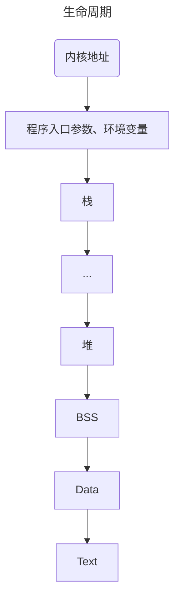

## 图示

```mermaid
---
title: 生命周期
---
flowchart TD
	id1(内核地址) --> id2[程序入口参数、环境变量] --> id3[栈] --> id4[...] --> id5[堆] --> id6[BSS] --> id7[Data] --> id8[Text]

```
## 描述

- 栈上和堆上的内存有各自的作用域，动态生命周期
- 全局变量、静态变量、字符串变量、代码等等会被编译到BSS/Data/RoData/Text段，加载时装入内存，静态生命周期
- 函数指针是静态生命周期